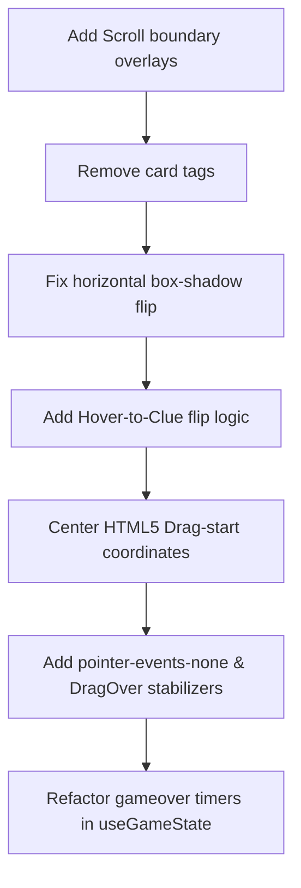

# Plan: Final Polish & UX Improvements

This plan details the implementation of 7 final polish and UX tasks, resolving timeline scrolling, card aesthetics, drag-and-drop cursor alignments, flickering dropzones, and timing fixes for game-over sequences.

---

## 🗺️ Implementation Roadmap



### 📋 Final Polish Checklist
- [x] **1. Timeline drag-hover scroll zones:** (Continuous interval scrolling triggered on boundary hover zones)
- [x] **2. Card category tag removal:** (Clean tagless fronts and backs for all card category icons and names)
- [x] **3. Rotated back-face box shadows:** (Mirrored horizontal shadows using offset utility classes)
- [x] **4. Hover description flip:** (Placed timeline cards reverse-flip on mouse hover to show clues)
- [x] **5. Lock drag cursor center:** (HTML5 setDragImage sets coordinates centered on cursor start)
- [x] **6. Stabilized dropzone flicker:** (onDragOver triggers indices, child elements have pointer-events-none)
- [x] **7. Post-animation game over hook:** (Timers complete correct/incorrect visual feedback before endGame transitions status)

---

## 🔍 Detailed Task Breakdown

### 1. Auto-scroll Timeline on Boundary Hover
We will render two invisible scroll trigger zones on the left and right edges of the viewport when `isDragging` is true. Hovering a card over these zones will scroll the timeline container via a continuous interval:
- **Left Zone:** `<div class="fixed left-0 top-[200px] w-24 h-80 z-40" onDragOver={scrollLeft} />`
- **Right Zone:** `<div class="fixed right-0 top-[200px] w-24 h-80 z-40" onDragOver={scrollRight} />`

### 2. Remove Tag Headers from Card Layout
In [TriviaCard.tsx](file:///home/jishnu/indian-trivia/src/components/TriviaCard.tsx), we will remove the top header blocks from both Face A (Clue) and Face B (Year):
- Delete the element containing `theme.icon`, `card.category`, and `HelpCircle` on Face A.
- Delete the element containing `theme.icon`, `card.category`, and `#id` on Face B.
- This leaves clean, tagless trivia cards.

### 3. Box-shadow Offset Compensation (Shadow Bug)
Because timeline cards are rotated 3D using `rotateY(180deg)`, the browser mirrors their drop-shadows to the left. We will add a compensated shadow utility in `src/index.css`:
```css
.shadow-brutal-back {
  box-shadow: -6px 6px 0px 0px #000000;
}
```
We will apply `shadow-brutal-back` on Face B. When rotated, the negative offset will be mirrored back to the right, aligning perfectly with Face A's shadow.

### 4. Hover-to-Clue Flip on Timeline
Timeline cards will flip over to reveal their description on hover:
- Add a hover state hook inside `TriviaCard.tsx`: `const [hoverFlipped, setHoverFlipped] = useState(false)`.
- If `revealed && !isCurrent` (placed timeline card), attach `onMouseEnter={() => setHoverFlipped(true)}` and `onMouseLeave={() => setHoverFlipped(false)}`.
- Render rotation style: `transform: hoverFlipped ? "rotateY(0deg)" : (isFlipped ? "rotateY(180deg)" : "rotateY(0deg)")`.

### 5. Center HTML5 Drag-start Cursor
In `GameBoard.tsx`'s `handleDragStart`, we will use `setDragImage` to lock the cursor to the exact center of the card:
```typescript
if (e.dataTransfer.setDragImage) {
  const rect = e.currentTarget.getBoundingClientRect();
  e.dataTransfer.setDragImage(e.currentTarget, rect.width / 2, rect.height / 2);
}
```

### 6. Flickering Dropzones Stabilizer
To eliminate dropzone flickering when a card shifts layout:
1. Move the `setHoveredDropzone` setting into the continuous `onDragOver` handler, which fires continuously.
2. Add `pointer-events-none` to the dropzone's children (the `Plus` icon and "PLACE CARD" label) to prevent child hover crossings from triggering parent `dragLeave` events.

### 7. Post-Animation Game Over Hook & Incorrect Splicing
We implemented a complete multi-stage incorrect placement flow:
1. **Wrong Splicing first:** `placeCard` inserts the card at `droppedIndex` first.
2. **Synchronous Lives check:** `placeCard` returns the decremented lives value synchronously, escaping the async React closure bug where `gameState.lives` was captured.
3. **GSAP FLIP Glide:** After the 1.6s incorrect shake animation finishes, we run `animateCardGlide` which shifts the card index to `correctIndex` in state and glides it smoothly to its correct layout position using GSAP.
4. **Style Year Red:** Added `isIncorrect` prop to style the year date badge with a neubrutalist red background (`#FF6B6B`) for all incorrectly placed cards.
