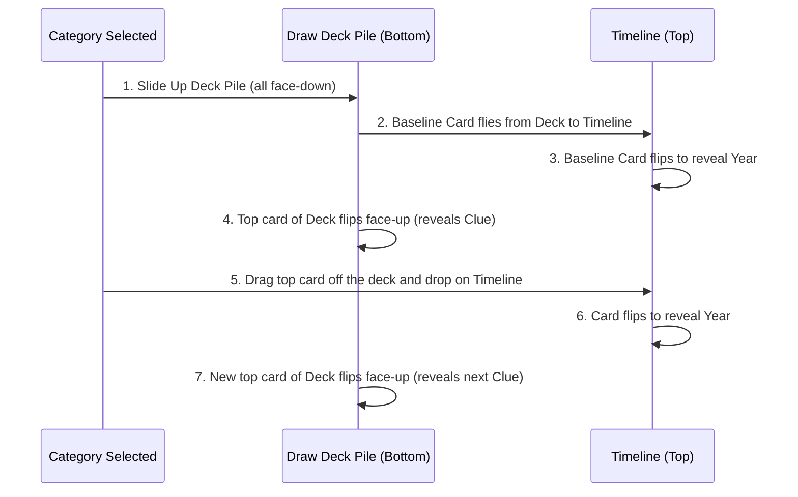

# Plan: Unified Physical Deck & Staged Deals

This plan implements a physical card deck layout. The active card (the card to sort) rests directly on top of the draw deck pile. The timeline baseline card flies from this deck to the timeline. Subsequent cards flip face-up in place on top of the deck, ready to be dragged directly off the pile.

---

## 📅 Simplified Game Loop Sequence



### 📋 Physical Deck Checklist
- [x] **Remove Separate Sorting Drawer:** (Next event card box deleted, layout simplified)
- [x] **Implement Draw Pile Stack:** (Underlying layered cards rendered at the bottom)
- [x] **Establish top card slot:** (The current active card rests directly on top of the pile)
- [x] **Coordinate Staggered Deal:** (Baseline card flies from `#draw-pile-deck` to timeline base placeholder and flips)
- [x] **Trigger top deck flip-up:** (Active card flips face-up right on top of the deck)
- [x] **Setup draw-reset loop:** (When placed, the top card resets to face-down, then flips face-up to show the next clue)
- [x] **Clean compilation builds:** (Verified builds successfully compile)

---

## 🛠️ 1. Unified Deck Pile Layout (`src/components/GameBoard.tsx`)

We will remove the separate "Next Event Card" drawer. Instead, the deck pile at the bottom will house both the face-down stack and the active draggable card on top:

```typescript
<div className="relative w-44 h-60 select-none">
  {/* Layered stack of cards underneath (Draw Pile) */}
  <div className="absolute inset-0 translate-y-3 translate-x-2 rotate-[4deg] bg-card-back border-[3px] border-black shadow-brutal-sm opacity-60"></div>
  <div className="absolute inset-0 translate-y-1.5 translate-x-[-1px] rotate-[-2deg] bg-card-back border-[3px] border-black shadow-brutal-sm opacity-80"></div>
  
  {/* Top card slot (ID: draw-pile-deck) */}
  <div id="draw-pile-deck" className="absolute inset-0 translate-y-0 translate-x-0 rotate-0">
    {showActiveCard ? (
      /* Draggable card sits on top of the deck, flipping face-up */
      <TriviaCard
        card={currentCard}
        revealed={false}
        isCurrent={!isAnimating}
        isDragging={isDragging}
        isSelected={isCardSelected}
        onDragStart={handleDragStart}
        onDragEnd={handleDragEnd}
        onClick={handleCardClick}
      />
    ) : (
      /* Temporary face-down card back shown during deals */
      <div className="w-full h-full border-[3px] border-black bg-card-back shadow-brutal flex justify-center items-center p-4">
        <div className="w-16 h-16 rounded-full border-[3px] border-black bg-[#FFF97A] flex items-center justify-center shadow-brutal-sm rotate-[-6deg]">
          <span className="text-3xl font-black text-black">?</span>
        </div>
      </div>
    )}
  </div>
</div>
```

---

## 🧠 2. Game Deal Timing Coordination

1. **Initial Mount Sequence:**
   - **T = 100ms:** Show Deck. (Pile appears at the bottom).
   - **T = 800ms:** Deal Baseline Card. (First card flies from `#draw-pile-deck` to `#timeline-base-placeholder`).
   - **T = 1550ms:** Base Card lands. (Mounts in timeline, turns year face-up, global deal overlay clears).
   - **T = 1700ms:** Flip Active Card. (`showActiveCard` -> `true`. Top card of the deck flips face-up on the deck).

2. **Subsequent Draw Sequence:**
   - When a card is correctly sorted and a new card is drawn:
     - `showActiveCard` is set to `false` (showing the face-down deck card).
     - After `300ms` (once placement feedback settles), `showActiveCard` becomes `true` (flipping the new top card of the deck face-up).
