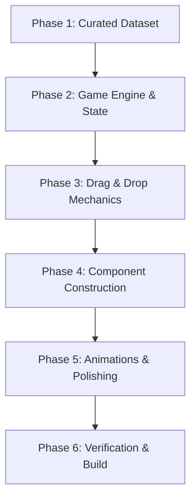

# Plan: Indian Trivia (Chronological Sorter Game)

Indian Trivia is a chronological order sorting game focused on Indian history, sports, cinema, science, and culture, inspired by `wikitrivia`. Players are presented with cards representing historical events and must place them on a timeline in the correct chronological order.

---

## 📅 Roadmap Overview



### 📋 Conductor Implementation Checklist
- [x] **Phase 1: Curated Dataset** (`src/data/trivia.ts`)
- [x] **Phase 2: Game Engine & State** (`src/hooks/useGameState.ts`)
- [x] **Phase 3: Drag & Drop Mechanics** (custom Pointer/Drag APIs)
- [x] **Phase 4: Component Construction** (`GameBoard`, `TriviaCard`, etc.)
- [x] **Phase 5: Animations & Polishing** (flips, shakes, glows)
- [x] **Phase 6: Verification & Build** (Bun compilation tests)

---

## 🛠️ Architecture & Tech Stack

- **Runtime & Bundler:** [Bun](https://bun.sh/) (configured with Hot Module Replacement and `bun-plugin-tailwind`).
- **Frontend Library:** React 19 (Hooks, Context, State).
- **Styling:** CSS Modules / Vanilla Tailwind CSS (modern color scheme, glassmorphism, responsive flex/grid layouts).
- **Icons:** `lucide-react` for playful UI indicators.
- **Animations:** CSS Keyframes & transitions, Tailwind utilities for tilt-on-hover, card flip, shake, and success popups.

---

## 🗃️ Phase 1: Trivia Dataset Schema (`src/data/trivia.json`)

To ensure a robust, offline-first v1 experience, we will create a curated dataset of Indian events. We'll group them into five distinct categories:
- **History & Politics** (`history`)
- **Sports** (`sports`)
- **Cinema & Art** (`cinema`)
- **Science & Technology** (`science`)
- **General Trivia** (`general`)

### Event Card Schema
```typescript
interface TriviaCard {
  id: string;          // Unique identifier
  title: string;       // Name of the event (e.g., "First Battle of Panipat")
  description: string; // Brief hint / context (e.g., "Babur defeated Ibrahim Lodi, marking the start of the Mughal Empire.")
  year: number;        // Year of occurrence (e.g., 1526)
  category: string;    // 'history' | 'sports' | 'cinema' | 'science' | 'general'
  image?: string;      // Optional local or Wikimedia image URL/icon placeholder
}
```

---

## 🧠 Phase 2: Game State & Rules Engine

The core game logic will run on a state machine managing:
1. **Lives (`lives`):** Max 3 hearts. Losing a life triggers a card shake and slides it automatically to its correct chronological place.
2. **Score (`score`):** Tracks the number of successfully placed cards.
3. **High Score (`highScore`):** Persisted in `localStorage` per category.
4. **Timeline (`timeline`):** An ordered list of successfully placed cards (starts with 1 initial card).
5. **Deck (`deck`):** Shuffled stack of unused cards for the active category.
6. **Current Card (`currentCard`):** The next card to be placed.

### Chronological Verification Rule
When the player drops a card at index `k` in a timeline of length `N`:
- The card is placed correctly if:
  `year(timeline[k - 1]) <= year(currentCard) <= year(timeline[k])`
- (Boundary cases where `k = 0` or `k = N` check only the successor or predecessor respectively.)

---

## 🏓 Phase 3: Drag & Drop Mechanics

To keep the app extremely responsive on both desktop and mobile, we will implement a custom, lightweight Drag & Drop interface using:
- **HTML5 Drag and Drop API** (with touch polyfill/fallback) or **PointerEvents** for full mobile responsiveness.
- **Drop Zones:** Visual markers placed between cards on the timeline:
  - Before the first card.
  - Between every pair of adjacent cards.
  - After the last card.
- **Fill Hover State:** When a card is dragged over a Drop Zone, the drop zone expands in width and glows with a playful animation ("fill on drag & drop").

---

## 🎨 Phase 4: UI Design & Component Layout

Aesthetically, the app will feature a sleek dark mode with glassmorphism, using a palette inspired by Indian colors (deep indigo/saffron/green highlights, customized to feel modern and premium):

### 1. `CategorySelect`
- Beautiful landing screen with large cards for each category.
- Custom gradient background, high-score badges, and hover scaling.

### 2. `TimelineBoard`
- Horizontally scrollable container that centers active cards.
- Floating score and heart indicator panels.

### 3. `TriviaCardComponent`
- **Front Face:** Event title, description/clue, category icon.
- **Back Face:** Shows the year (revealed after correct placement or game over).
- **Animations:**
  - **Flip on Hover:** Hovering over the card in the "current" slot tilts/flips it slightly to show its back info outline or a playful hint.
  - **Shake on Error:** Red flash and side-to-side shake if dropped in the wrong position.
  - **Scale up on Success:** A bouncy scaling effect with green glow when placed correctly.

---

## 🎬 Phase 5: Animations & Micro-Interactions

To create the requested playful UI:
- **Card Tilt & Float:** Hovering over cards uses CSS 3D transforms for a modern tilt effect.
- **Dropzone Expander:** Custom transitions that expand dropping margins smoothly when dragging.
- **Lives Shake:** The hearts container shakes (`animate-shake`) and drops a heart with a fade-out animation when a mistake is made.
- **Celebration Particle Effect:** A lightweight custom confetti effect bursts from the dropped position upon scoring a point.

---

## 🚀 Phase 6: Build & Test Strategy
1. **Local Dev:** Run the server using `bun run dev` and ensure Hot Module Replacement is responsive.
2. **Data Verification:** Write a validation check in `build.ts` to ensure all trivia items have valid fields and no duplicates.
3. **Build:** Bundle using `bun run build` to generate optimized production artifacts.
