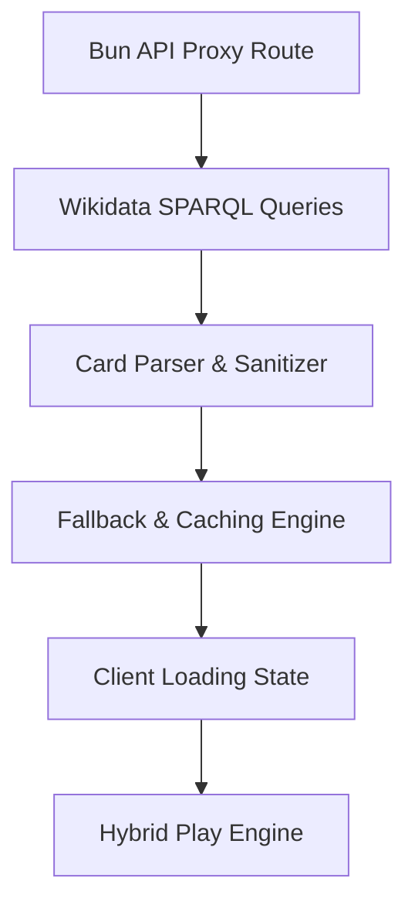

# Plan: Wikimedia Wikidata Integration (Dynamic Cards)

This plan outlines the architecture, queries, and steps to integrate the Wikidata SPARQL API into the **Bharat Chrono** sorting game. The application will dynamically query Wikidata for Indian-related events, sanitize the dates, select 10 random events, and feed them to the game loop.

---

## 🗺️ Integration Roadmap



### 📋 Integration Checklist
- [x] **Bun API Proxy Route** (`src/index.ts`)
- [x] **Wikidata SPARQL Queries** (Category-specific Indian events)
- [x] **Card Parser & Date Sanitizer** (Extracting CE/BCE years)
- [x] **Fallback & Caching Engine** (In-memory cache + offline static data fallback)
- [x] **Client Loading State** (Neubrutalist loading spinner skeleton)
- [x] **Hybrid Play Engine** (Seamless loading flow)

---

## 🔌 1. Bun API Proxy (`src/index.ts`)
To bypass browser CORS restrictions and prevent hitting Wikidata rate limits, the Bun server will expose a proxy endpoint: `/api/wikidata?category=[sports|history|cinema|science|general]`.

### Features of the Proxy:
1. **Wikidata Request Headers:** Requests to `https://query.wikidata.org/sparql` require a custom `User-Agent` (e.g., `BharatChrono/1.0 (contact@example.com)`) and `Accept: application/sparql-results+json`.
2. **In-Memory Cache:** Cache results for 10 minutes per category. If a user plays consecutive matches in the same category, we serve cached cards immediately.
3. **Randomizer:** Query up to 100 events, parse them, filter out events with missing titles/descriptions, and select 10 random items to send to the client.

---

## 🗃️ 2. Wikidata SPARQL Queries

We will define category-specific SPARQL queries to query entities related to India with points in time.

### A. Sports & Games (`sports`)
Queries events that are instances of "sporting event" (`wd:Q1656509`), "championship" (`wd:Q3244832`), or "match" (`wd:Q208846`) located in or associated with India (`wd:Q668`).
```sparql
SELECT DISTINCT ?item ?itemLabel ?itemDescription ?date WHERE {
  ?item wdt:P31/wdt:P279* ?type.
  VALUES ?type { wd:Q1656509 wd:Q3244832 wd:Q208846 }
  { ?item wdt:P17 wd:Q668. } UNION { ?item wdt:P276/wdt:P17* wd:Q668. }
  BIND(COALESCE(?p585, ?p580) AS ?date)
  OPTIONAL { ?item wdt:P585 ?p585. }
  OPTIONAL { ?item wdt:P580 ?p580. }
  FILTER(BOUND(?date))
  SERVICE wikibase:label { bd:serviceParam wikibase:language "en". }
  FILTER(EXISTS {
    ?item rdfs:label ?label.
    FILTER(LANG(?label) = "en")
  })
} LIMIT 100
```

### B. History & Politics (`history`)
Queries instances of "historical event" (`wd:Q13414953`), "battle" (`wd:Q178561`), "treaty" (`wd:Q131569`), or "election" (`wd:Q40262`) in India.

### C. Cinema & Arts (`cinema`)
Queries instances of "film" (`wd:Q11424`) with publication date (`wdt:P577`) and country of origin India (`wd:Q668`).

### D. Science & Technology (`science`)
Queries space launches, missions, and scientific discoveries associated with India.

### E. General & Culture (`general`)
Queries general events, infrastructure projects, and awards associated with India.

---

## 🛠️ 3. Card Parser & Date Sanitizer

Dates returned from Wikidata are in ISO format (e.g. `"+1983-06-25T00:00:00Z"`). We must extract:
- **Year:** Parse the year integer (positive for CE, negative for BCE).
- **Label / Title:** Clean up standard Q-code labels.
- **Description:** Provide fallback summaries if the Wikidata description is empty (e.g. "Historical Indian milestone.").

---

## 🛡️ 4. Hybrid Offline-Fallback Engine
To ensure the game never breaks when a user has no internet access or Wikidata is offline:
1. Try fetching from `/api/wikidata?category=...`.
2. If it succeeds, load the 10 fetched cards.
3. If it fails (due to timeout, server error, or rate limits), **log a warning and fall back to our local `TRIVIA_DATA` dataset** for that category.
4. The transition is completely seamless to the player, maintaining high reliability.

---

## 🎨 5. Neubrutalist Loading State

While fetching data from the API:
- Render a blocky Neubrutalist skeleton screen.
- Pulsating placeholder cards with dotted lines and a spinner reading `"FETCHING FROM WIKIMEDIA..."` to keep the UI engaging.
