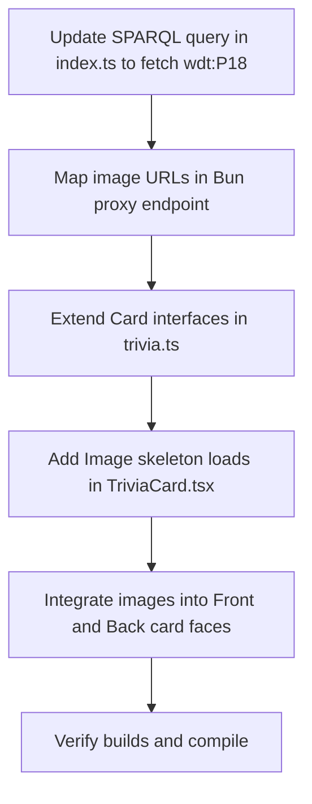

# Plan: Wikidata Image Integration & Skeleton Loading

This plan details integrating open-source images from Wikimedia Commons into trivia cards using Wikidata's `P18` (image) property. A CSS skeleton loader will reserve image layouts on mount, preventing layout shifts when images finish fetching.

---

## 🗺️ Implementation Roadmap



---

## 🔍 Detailed Task Breakdown

### 1. SPARQL & Bun Proxy Enhancements (`src/index.ts`)
We will append `?image` selection to the category SPARQL queries. To optimize execution speed, we will query images on the selected subquery results:
```sparql
SELECT ?item ?itemLabel ?itemDescription ?date ?image WHERE {
  {
    SELECT DISTINCT ?item ?date WHERE {
      ...
    } LIMIT 50
  }
  OPTIONAL { ?item wdt:P18 ?image }
  SERVICE wikibase:label { bd:serviceParam wikibase:language "en". }
}
```
We will parse `b.image?.value || null` in the mapping parser and return it in the JSON cards payload.

### 2. Interface Update (`src/data/trivia.ts`)
We will update the `TriviaCard` type definition to include `image` state parameters:
```typescript
export interface TriviaCard {
  id: string;
  title: string;
  description: string;
  year: number;
  category: "history" | "sports" | "cinema" | "science" | "general";
  image?: string | null;
}
```

### 3. Skeleton Image Loader (`src/components/TriviaCard.tsx`)
To eliminate Cumulative Layout Shift (CLS):
1. Reserve a fixed-size container block (`w-full h-16 border border-black bg-slate-100`).
2. Maintain local loading state: `const [imageLoaded, setImageLoaded] = useState(false)`. Reset this state on card ID changes.
3. Show a pulsing skeleton placeholder inside the container when `!imageLoaded`.
4. Render the `img` with `onLoad={() => setImageLoaded(true)}`, transitioning its opacity from `0` to `1` when complete.

### 4. Card Face Layout Refactoring
We will fit images onto card faces by adjusting heights:
- **Clue Face (Face A):** Place the image between the title and the description. Set the description line clamp to `line-clamp-3` and font size to `text-[9px]` to keep it within the `240px` bounds.
- **Year Face (Face B):** Place the image between the year calendar badge and the title. Set title line clamp to `line-clamp-2` to avoid card height expansion.
